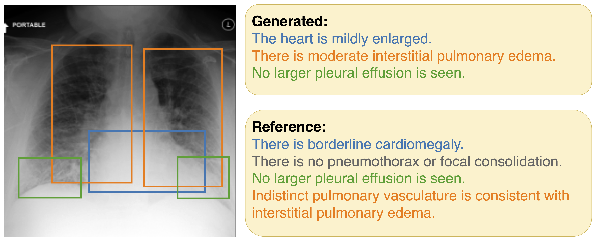

# ChEX: Interactive Localization and Region Description in Chest X-rays
This is the official PyTorch implementation of ChEX (ECCV 2024).

**[[Paper - arXiv:2404.15770]](https://arxiv.org/abs/2404.15770) | Accepted at ECCV 2024**

> **ChEX: Interactive Localization and Region Description in Chest X-rays (ECCV 2024)** <br>
> Philip Müller, Georgios Kaissis, and Daniel Rueckert <br>

> **Abstract:** Report generation models offer fine-grained textual interpretations of medical images like chest X-rays, yet integrating them seamlessly into clinical workflows remains challenging due to limited interpretability and interactivity complicating manual intervention. 
While there have been some efforts to tackle these issues, previous models lack support for textual queries or fail to provide bounding boxes for their textual answers. We address these limitations by proposing a novel multitask architecture and training paradigm integrating textual prompts and bounding boxes for diverse aspects like anatomical regions and pathologies. We call this approach the Chest X-Ray Explainer (ChEX). Evaluations across a diverse set of 9 chest X-ray tasks, including localized image interpretation and report generation, showcase its competitiveness with SOTA models while additional analysis demonstrates ChEX’s interactive capabilities. Code will be made available upon acceptance.

<p align="center">

</p>

**Figure 1:** Given a chest X-ray and a user query, either as a textual prompt (e.g., a pathology name, an anatomical region, or both) or as a bounding box, the model predicts a textual description of the queried region or aspect. For textual user prompts, it additionally predicts relevant bounding boxes. Thus, ChEX facilitates the interactive interpretation of chest X-rays while providing (localized) interpretability.


## Outline

1. [Model Overview](#model-overview)
2. [Setup (Environment and Datasets)](#setup-environment-and-datasets)
3. [Training](#training)
4. [Evaluation](#evaluation)
5. [Results](#results)
6. [Source-Code Structure](#source-code-structure)
7. [Model Checkpoints](#model-checkpoints)
8. [Citation](#citation)
9. [Notice](#notice)

## Model Overview
<p align="center">

</p>

**Figure 2:** Architecture of ChEX. The DETR-style ${\textsf{\color{green}prompt detector}}$ predicts bounding boxes and features for ROIs based on prompt tokens (textual prompts encoded by the ${\textsf{\color{purple}prompt encoder}}$) and patch features (from the ${\textsf{\color{blue}image encoder}}$). The ${\textsf{\color{orange}sentence generator}}$ is then used to predict textual descriptions for each ROI independently.

## Setup (Environment and Datasets)
The setup includes preparation of the environment (conda/paths) and dataset downloads

## Environment Setup
For setup of the python environment and specification of paths, execute the following steps:

1. Run the following commands from the root dir of this project:

        conda env create -f environment.yaml 
        conda activate chex
        pip install -e .

2. Setup W&B by setting the environment variables `WANDB_PROJECT` (the project name here, defaulting to "chex") and `WANDB_ENTITY` (your W&B username)

        conda env config vars set WANDB_PROJECT=chex
        conda env config vars set WANDB_ENTITY=<your wandb username>
        conda deactivate
        conda activate chex

3. Specify a model logging directory by setting the environment variable `MODELS_DIR`. By default ``~/models/chex`` will be used. This folder will be used to store all model weights and logging (in sub folders for each model / training run)

4. Download the CheXzero model weights from https://drive.google.com/drive/folders/1makFLiEMbSleYltaRxw81aBhEDMpVwno and store them in the directory ``~/models/third_party/chexzero/CheXzero_Models/best_64_5e-05_original_22000_0.864.pt``. Make sure you have downloaded the weights file ``best_64_5e-05_original_22000_0.864.pt``, other files are not required.

5. (Optional) Download the trained ChEX model weights from https://drive.google.com/file/d/1TFBOSV_jEdh2E6mBlv1qDlxJl9Wf9xZO/view?usp=sharing and unzip them in the model directory (as defined in ``MODELS_DIR``, e.g. ``~/models/chex/``). 
Make sure you have the folder ``chex_stage3`` extracted directly in the model directory (e.g. ``~/models/chex/chex_stage3``). 
This is not required for training, but can be used to evaluate the model directly. 


### Automatic Dataset Download
Manual downloads of datasets are not required, but automatic downloads require a Physionet user with credentialed access to the relevant datasets (dataset links will be prompted when starting training for the first time) and a Kaggle account. If you have already downloaded the relevant datasets, you can skip the following steps and follow the instructions of ``Using Pre-Downloaded Datasets``

For automatic downloads follow these steps:
1. Specify a Physionet user by setting the environment variable `PHYSIONET_USER`. Make sure this user has credentialed access to all relevant datasets. The password will be asked when starting training for the first time, when the dataset will de downloaded automatically. The relevant dataset links will also be prompted before asking the password, so you can check that you have access to all of these datasests.

2. Make sure you have setup the Kaggle public API and have prepared the ``~/.kaggle/kaggle.json`` file (see https://www.kaggle.com/docs/api)

3. Specify a dataset directory where datasets will be downloaded and stored by defining the environment variable ``DATA_DIR``. By default ``~/datasets`` will be used.

4. Dataset download and pre-processing should happen automatically when starting training/evaluation. Alternatively, this can be invoked by running the dataset scripts ``src/dataset/mimic_cxr_datasets.py``, ``src/dataset/vindr_cxr.py``, or ``src/dataset/nih_cxr.py``. For MIMIC-CXR, calling ``src/dataset/mimic_cxr_datasets.py`` expects the name of the dataset as defined in the dataset configs in ``conf/dataset``


### Using Pre-Downloaded Datasets
The following steps explain how you can prepare the datasets if you have already downloaded them (have them available in your filesystem).
If you have already done the automatic download of datasets as described in ``Automatic Dataset Download``, you can skip these steps.

Follow these steps:
1. Specify the paths of the raw dataset downloads by setting the folliwing environment variables:
   - `MIMIC_CXR_JPG_DIR`: This should correspond to the raw MIMIC-CXR-JPG dataset (https://physionet.org/content/mimic-cxr-jpg/2.0.0/), directly including all csv/csv.gz files and the jpg images in the original folder structure (within the files folder)
   - `MIMIC_CXR_REPORT_DIR`: This should correspond to the raw MIMIC-CXR dataset (https://physionet.org/content/mimic-cxr/2.0.0/), directly including all csv/csv.gz files and the report files in the original folder structure (within the files folder). DICOM-images are not required!
   - `CHEST_IMAGENOME_DIR`: This should correspond to the raw Chest ImaGenome dataset (https://physionet.org/content/chest-imagenome/1.0.0/). The folder should directly include the silver dataset folder (as its own folder, not just the contents of it)
   - `MS_CXR_DIR`: This should correspond to the raw MS-CXR dataset (https://physionet.org/content/ms-cxr/0.1/)
   - `VINDR_CXR_DIR`: This should correspond to the raw VinDr-CXR dataset (https://physionet.org/content/vindr-cxr/1.0.0/) including all folders
   - `CXR14_DIR`: This should correspond to the raw NIH ChestXray 14 dataset (https://nihcc.app.box.com/v/ChestXray-NIHCC/) including the images folder and all csv and txt files
2. Specify the paths for the pre-processed datasets by setting the folliwing environment variables: 
   - `MIMIC_CXR_PROCESSED_DIR`: for MIMIC-CXR, CIG, and MS-CXR
   - `VINDR_CXR_PROCESSED_DIR`: for VinDr-CXR
   - NIH ChestXray 14 will be pre-processed directly in the source folder (no image pre-processing is applied)
3. Dataset pre-processing should happen automatically when starting training/evaluation. Alternatively, this can be invoked by running the dataset scripts ``src/dataset/mimic_cxr_datasets.py``, ``src/dataset/vindr_cxr.py``, or ``src/dataset/nih_cxr.py``. For MIMIC-CXR, calling ``src/dataset/mimic_cxr_datasets.py`` expects the name of the dataset as defined in the dataset configs in ``conf/dataset``


## Training
For training ChEX, run the following commands for the specific training stages:

    python src/train.py +experiment=chex_stage1_train
    python src/train.py +experiment=chex_stage2_train
    python src/train.py +experiment=pretrain_txtgen
    python src/train.py +experiment=chex_stage3_train

Model weights will be stored in the specified `MODELS_DIR`. Model names can be overwritten by specifiying `name=<your model name>` as command line argument. 
Note training stages load weights from previous training stages so the loaded model names have to be adaped accordingly, see `conf/model/chex_stage2` and `conf/model/chex_stage3` (`load_components_from`). All configs can be overwritten by command line arguments (see Hydra documentation: https://hydra.cc/).

## Evaluation
To evaluate ChEX, run the following commands.
For evaluaiton all object detection (OD) and sentence grounding tasks (SG):

    python src/evaluate.py +experiment=eval_od eval_mode=test optimize_inference=true bootstrap=true model_name=chex_stage3

For evaluaiton all region classificaiton (RC) tasks:

    python src/evaluate.py +experiment=eval_rc eval_mode=test bootstrap=true model_name=chex_stage3

For evaluaiton all region explanation (RE) and classificaiton (RC) tasks:

    python src/evaluate.py +experiment=eval_txt eval_mode=test bootstrap=true model_name=chex_stage3


Note that `optimize_inference` is only required for the first evaluation and automaticall adapts post-processing for the datasets.
`bootstrap` enables bootstrapping for metrics computation, you can also disable it to speed up evaluation.
`eval_mode` can also be set to `val` if you want to run evaluation on the validaiton set (e.g. for hyperparameter tuning).
`model_name` can be replaced by the name of the model you want to evaluate.

## Results
<p align="center">

</p>
<p align="center">

</p>

## Source-Code Structure
### ChEX Model and Training/Evaluation Code
- ChEX main model: ``src/model/chex.py``
- ChEX encoder/decoder/detector components: ``src/model/img_encoder``, ``src/model/txt_encoder``, ``src/model/txt_decoder``, ``src/model/detector``
- ChEX training code: ``src/model/supervisors``
- ChEX evaluation code: ``src/model/eval``

### Configs
- ChEX model configs: ``conf/model/chex_stage1.yaml``, ``conf/model/chex_stage2.yaml``, amd ``conf/model/chex_stage3.yaml``
- ChEX training configs: ``conf/experiment/chex_stage1_train.yaml``, ``conf/experiment/chex_stage2_train.yaml``, ``conf/experiment/chex_stage3_train.yaml``, and ``conf/experiment/pretrain_txtgen.yaml``
- ChEX evaluation task configs: ``conf/task/``
- Prompts used for training and inference: ``conf/prompts/``
- Dataset configs (loading options, class-names, ...): ``conf/dataset/``

### Other Directories and Files:
- ``src/chexzero``: Third-party code for the image and text encoders (ChEX uses CheXZero as the image and text encoder)
- ``src/dataset``: Data-preprocessing and -loading for training and evaluation
- ``src/metrics``: Evaluation metrics for all tasks
- ``src/utils``: Additional utilities
- ``train.py``: Training script (which calls individual supervisors based on the config, see ``conf/experiment/chex_stage*_train.yaml``)
- ``evaluate.py``: Evaluation script (which calls individual evaluators based on the config, see ``conf/task``)
- ``settings.py``: Definitions of paths/environment variables

## Model Checkpoints
The model checkpoint for the ChEX model (stage 3) can be found at 

    https://drive.google.com/file/d/1TFBOSV_jEdh2E6mBlv1qDlxJl9Wf9xZO/view?usp=sharing

To use the model, download the zip file and extract it into the model directory (as defined in ``MODELS_DIR``, e.g. ``~/models/chex/``).
After extraction a folder ``chex_stage3`` should be present in the model directory (e.g. ``~/models/chex/chex_stage3``) and the model can be used for evaluation (as described in the evaluation section).

## Citation
```
@article{mueller2024chex,
  title={ChEX: Interactive Localization and Region Description in Chest X-rays},
  author={Müller, Philip and Kaissis, Georgios and Rueckert, Daniel},
  journal={arXiv preprint arXiv:2404.15770},
  doi={10.48550/arXiv.2404.15770},
  year={2024}
}
```

## Notice
This project includes third-party software components that are subject to their respective licenses, as described in the [NOTICE](./NOTICE.txt) file, which provides information about the third-party components used, including their names, licenses, and copyright holders. Please review the NOTICE file before using or distributing this software.